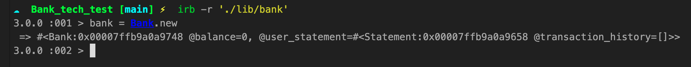
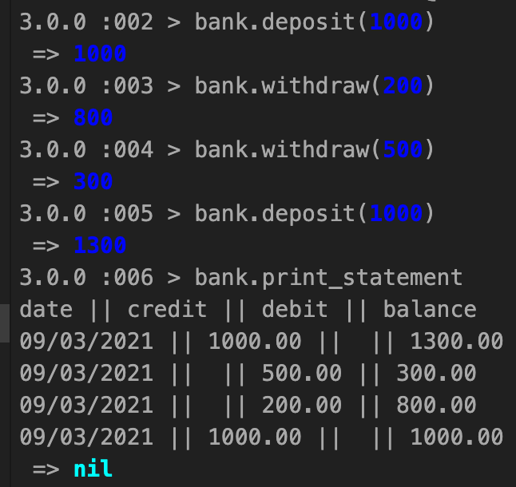

# Bank tech test

This is the repo for the bank tech test. This script will allow users to withdraw/deposit an amount into their account. Users can print bank statements detailing their recent transactions.  

## Build status:

At it's current build status. This script allows users to create a bank object with which they can deposit or withdraw money to/from, as well as print a statement of all their transactions.

Future development may include adding a database or csv system for long term memory.

## Implemented features:

Here is a list of the currently implemented features with screenshots.

* Bank class exists

* Has an empty account on initialisation

* Can deposit money within the account

* Can withdraw money from the account

* Can only withdraw money that is available in account

* Statement class
* Statement class has empty history on initialisation
* statement class can add credit transaction to history
* statement class can add debit transaction to history
* statement class can build a transaction table with all transactions
* Bank can print out a transaction statement



## User instructions:

To install this script run:
`<git clone git@github.com:RTurney/Bank-tech-test.git>`

To use this code please run form the command line:
```
cd Bank-tech-test
irb -r './lib/bank'
```
To create a bank object please run:
```
bank = Bank.new  
```
To check your current balance please run:
```
bank.balance
```
To deposit some money please run:
```
 bank.deposit(amount)
```
To withdraw some money please run:
```
bank.withdraw(amount)
```
To print a bank statement please run:
```
bank.print_statement
```

## Tests

If you wish to run the test infrastructure for this project, just run `<rspec>` in the command terminal.

The full spectrum of tests can be found within the spec folder and are run with RSpec.

## Upcoming features:
 This is a list of upcoming features to be implemented within this project:

 * ~~a bank object~~
 * ~~deposit method~~
 * ~~withdrawal method~~
 * ~~statement class~~
 * ~~statement includes credit with date and balance~~
 * ~~statement includes debit with date and balance~~
 * ~~statement can format itself in as a table with all transactions~~
 * ~~bank can print statement as a table~~

## User stories:

```
As a capitalist,
So that I can hoard my money,
I would like to open a bank account
```
```
As a capitalist,
So that I can store my money safely,
I would like to deposit money in my account.
```
```
As a capitalist,
So that I can feed my family,
I would like to withdraw money from my account when needed.
```
```
As a capitalist,
So that I can plan for next month,
I would like to see the current amount in my account.
```
```
As a capitalist,
So that I can monitor my account for identity theft,
I would like to see a bank statement with dates of each transaction.
```
